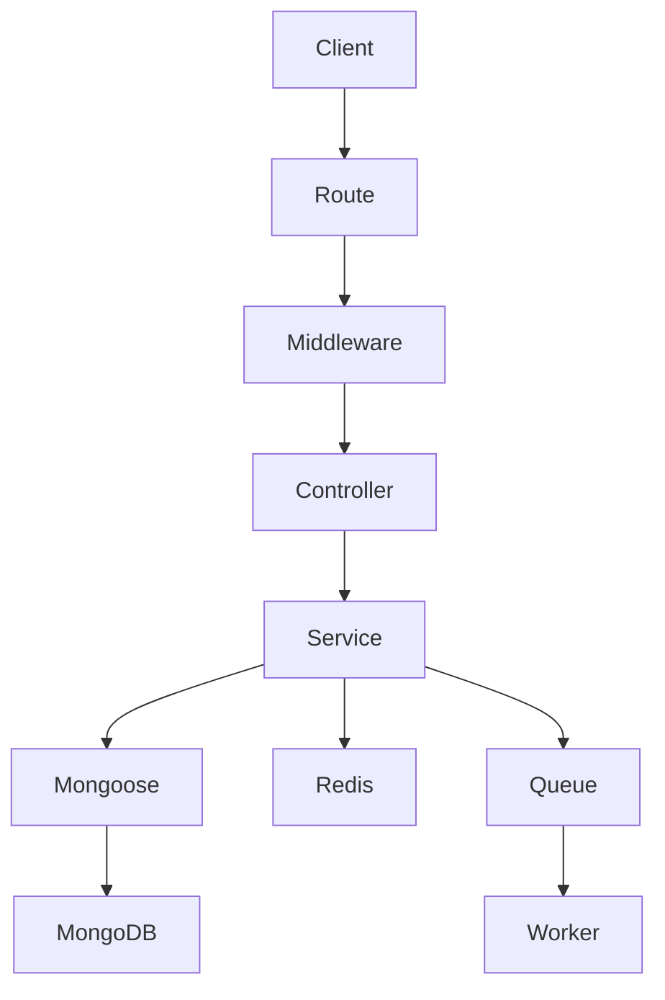

# Architecture

Features live under `src/modules`. Routes are declarative, controllers call services, and services use Mongoose models directly. Zod validates request sections before controllers. `ApiError` and the final error middleware provide safe, consistent errors.

JWT access tokens protect APIs and roles are enforced by reusable middleware. Passwords use Argon2. Refresh-token rotation and revocation can be added by persisting sessions; the starter keeps logout stateless. MongoDB and Redis lifecycle is centralized. BullMQ and Socket.IO are ready for dedicated workers and horizontal scaling adapters.

Pino provides structured redacted logs. The application runs directly as a compiled Node.js process.
